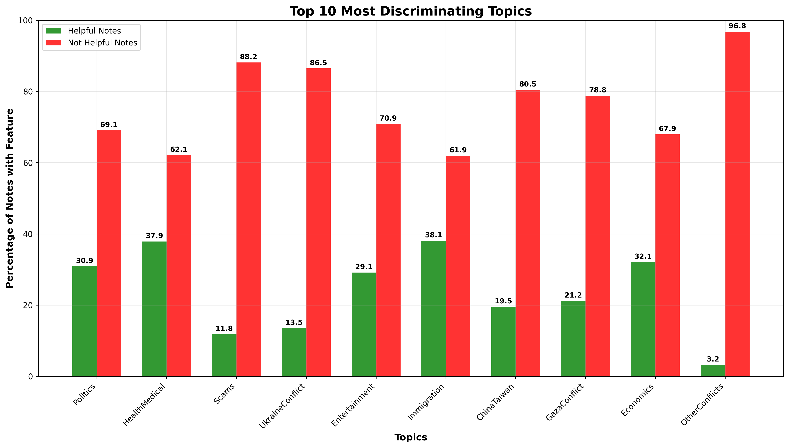
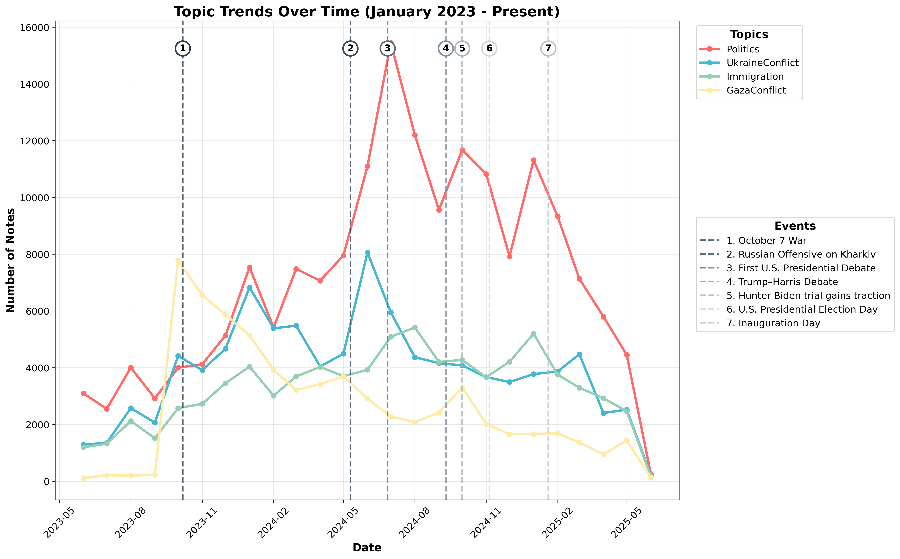
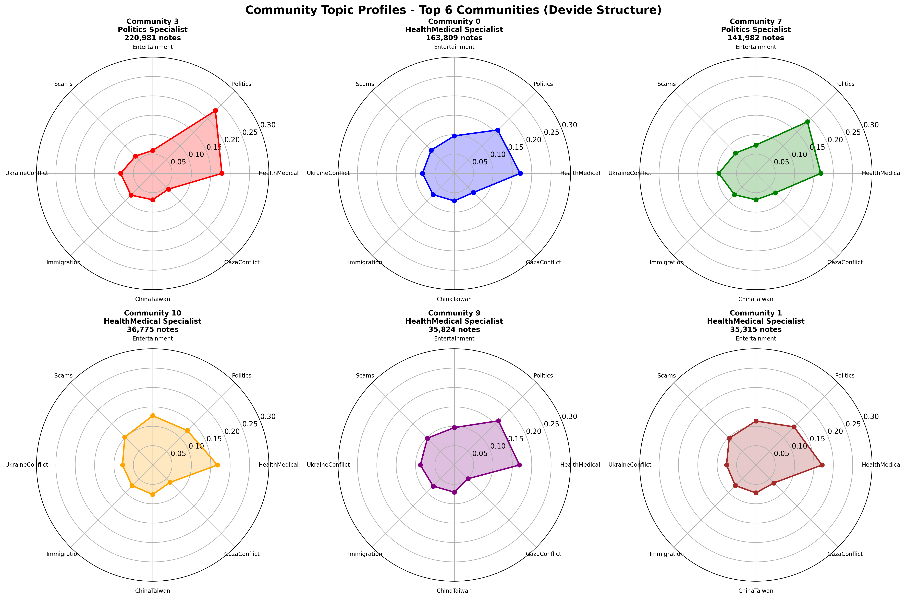
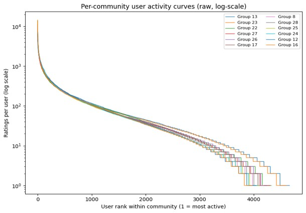

# X-Community-Notes-Analysis
Analysis of 1.2M+ X Community Notes using NLP and network analysis. Investigates the impact of trustworthy sources, contributor polarization, and the "consensus paradox" in crowdsourced fact-checking.

# **Motivation**
Who is actually fact-checking the fact-checkers? Beyond analyzing the notes themselves, this project scrutinizes the "crowd" behind them to see if contributors bridge divides or fracture into polarized echo chambers. We investigate whether user activity patterns signal healthy diversity or potential manipulation (e.g., bots) by hyperactive minority groups. Ultimately, we aim to answer a critical question: does Community Notes serve as a genuine corrective to misinformation, or does it risk reproducing the very societal divisions it was designed to fix?

---

## 📊 Key Findings & Visualizations

### 1. Topic Classification & Polarization
We developed a custom **15-topic classification system** to measure which subjects are most susceptible to polarization. The results highlight a stark contrast in "helpfulness" rates: while notes on domestic topics like **Health/Medical** and **Immigration** achieve consensus ~40% of the time, notes on geopolitical conflicts (e.g., **Ukraine**, **Gaza**) struggle significantly, dropping to 13-21%. This confirms that the most divisive topics are exactly where the system struggles most to validate facts.


*Figure 1: Helpfulness rates by topic. Green bars represent the percentage of notes rated "Helpful." Note the sharp drop in agreement for conflict-related topics (Ukraine, Gaza) compared to Health or Immigration.*

### 2. "Fact-Checking" the Classifier
To validate our classification model without ground truth, we correlated topic volume spikes with real-world events. The alignment was precise, confirming the model's ability to detect breaking news trends instantly.

* **Validation:** Spikes in "Gaza Conflict" notes aligned perfectly with Oct 7; "Politics" spikes aligned with US Presidential Debates.


*Figure 2: Temporal analysis showing topic volume spikes aligning with major global events.*

### 3. Community Detection & Echo Chambers
Using the **Louvain algorithm**, we identified distinct communities of contributors. While many users are generalists, we found highly specialized "echo chambers"—clusters of users who almost exclusively rate notes on specific topics like **Politics** or **Health**.


*Figure 3: Radar charts revealing the extreme topic specialization of the top contributor communities.*

### 4. The "Power User" Dynamic (Long-Tail Distribution)
Our analysis of user activity reveals a classic **long-tail distribution**. The vast majority of contributors rate only a handful of notes, while a tiny, hyper-active minority drives the bulk of the platform's activity. This raises critical questions about the outsized influence of a few "super-raters."


*Figure 4: Distribution of user activity, showing that a small percentage of users generate the majority of ratings.*

---

## 🚀 Key Features

* [cite_start]**15-Topic Classification System:** Automated labeling for Ukraine Conflict, Gaza Conflict, Syria War, Iran, China-Taiwan, China Influence, Scams, Health/Medical, Climate, Politics, Tech, Economics, and more[cite: 126, 131].
* [cite_start]**Hybrid NLP Model:** TF-IDF + Logistic Regression pipeline achieving **81.4% accuracy** with high efficiency (~1000 notes/sec)[cite: 134, 139].
* [cite_start]**Community Detection:** Network analysis using Louvain modularity to identify echo chambers and topic leadership[cite: 301].
* [cite_start]**Comprehensive EDA:** Statistical analysis of user activity, "power user" curves, and temporal trends[cite: 318].


[cite_start]*Figure 4: Validating the classifier—Topic spikes align perfectly with real-world events (Oct 7, US Debates)[cite: 154].*

---

## 📁 Project Structure

```text
.
├── code/
│   ├── classification/
│   │   ├── topic_classifier.py          # TF-IDF + LogReg Classification engine
│   │   └── analyze_classification_results.py
│   ├── clustering/
│   │   ├── communities_analysis.py      # NetworkX & Louvain implementation
│   │   └── louvain_communities.ipynb    # Community analysis notebook
│   ├── eda/
│   │   └── eda_analysis.py              # Statistical analysis scripts
│   ├── demo_workflow.py                 # End-to-end demo script
│   └── generate_report.py               # Automated report generator
├── run_analysis.py                      # Main entry point CLI
├── plots/                               # Generated Figures
│   ├── topic_classification/
│   ├── comuunity_detection/
│   └── eda/
└── README.md
