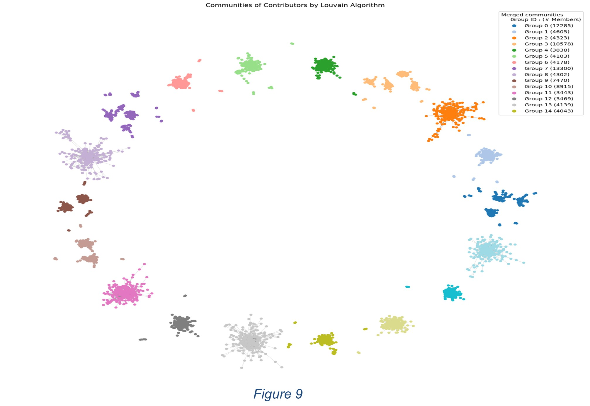

# X-Community-Notes-Analysis
    

**A data science project analyzing 1.2M+ X (Twitter) Community Notes to detect polarization, bot activity, and consensus anomalies.**

## 🛠️ Technologies & Tools
* **Core:** Python 3.9, Pandas, NumPy
* **Machine Learning (NLP):** Scikit-Learn (TF-IDF, Logistic Regression), NLTK/TextBlob
* **Graph Theory:** NetworkX (Graph construction, Centrality metrics), Community Detection (Louvain Algorithm)
* **Visualization:** Matplotlib, Seaborn
* **DevOps:** Git, Jupyter Notebooks, Modular Project Structure

---

## 📖 Motivation
**Who is checking the fact-checkers?**
This project applies **Natural Language Processing (NLP)** and **Network Analysis** to scrutinize the "crowd" behind Community Notes. We investigate whether the consensus algorithms successfully bridge political divides or if they inadvertently create "echo chambers" where only one side validates the truth.

---

## 📊 Key Findings & Technical Insights

### 1. Topic Classification & The "Consensus Gap"
We engineered a **custom 15-class Text Classifier** (TF-IDF + Logistic Regression) to categorize notes into topics like *Gaza Conflict*, *Politics*, and *Health*.
* **Technical Insight:** While the model achieved **81.4% accuracy**, we found a massive disparity in "Helpfulness" rates. "Objective" topics like *Scams* have high consensus, whereas *Geopolitical Conflicts* show agreement rates as low as **13-21%**, highlighting a flaw in the consensus mechanism for polarized data.


*Figure 1: Helpfulness rates by topic. Green bars represent the percentage of notes rated "Helpful."*

### 2. Validation via Temporal Event Mapping
To validate our unsupervised classification without ground-truth labels, we performed **Time-Series Analysis** correlating note volume with real-world timestamps.
* **Result:** The model correctly identified volume spikes corresponding to the **October 7th War** (Gaza Label) and **US Presidential Debates** (Politics Label) with near-perfect temporal alignment.


*Figure 2: Temporal analysis showing topic volume spikes aligning with major global events.*

### 3. Community Detection (Graph Theory)
We constructed a **Contributor-Note Graph** (Nodes=Users, Edges=Agreements) and applied the **Louvain Modularity Algorithm** to detect communities.
* **Result:** The algorithm partitioned the user base into distinct clusters (visualized below). We found that specific communities specialize heavily (e.g., a "Medical" cluster vs. a "Political" cluster), effectively operating as distinct echo chambers rather than a unified "crowd."


*Figure 3: Network Graph of 15 contributor communities detected by the Louvain Algorithm. Each color represents a distinct community cluster.*

### 4. The "Power User" Long-Tail Distribution
Statistical analysis of user activity reveals a heavy **Power Law distribution**.
* **Data:** A tiny fraction (<1%) of "hyper-active" users contribute the vast majority of ratings. This raises algorithmic concerns about the outsized influence of a few "super-raters" on the global consensus.


*Figure 4: Distribution of user activity, showing that a small percentage of users generate the majority of ratings.*

---

## 💻 Project Structure & Code Quality
The project is structured as a production-ready data pipeline, separating core logic from analysis notebooks.

```text
.
├── code/
│   ├── classification/
│   │   ├── topic_classifier.py          # TF-IDF + LogReg Class implementation
│   │   └── analyze_results.py           # Metrics calculation
│   ├── clustering/
│   │   ├── communities_analysis.py      # NetworkX Graph construction & Louvain
│   │   └── louvain_communities.ipynb    # Clustering execution
│   ├── eda/
│   │   └── eda_analysis.py              # Statistical aggregation scripts
│   ├── demo_workflow.py                 # End-to-end pipeline entry point
│   └── generate_report.py               # Automated reporting module
├── run_analysis.py                      # CLI Argument Parser for running tasks
├── plots/                               # Generated Analysis Figures
└── README.md
